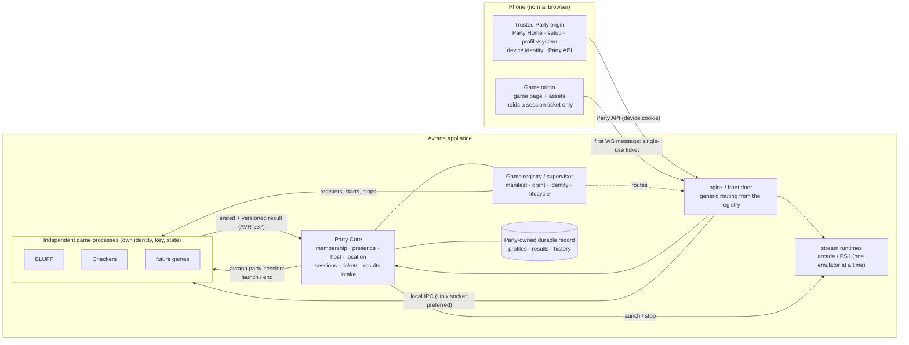
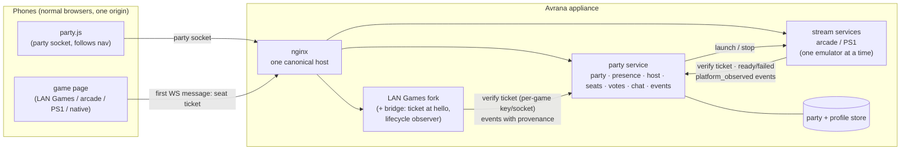

# Game integration: capabilities, runtime, and the party contract

Status: **integration guide reconciled 2026-10-01.** Current contracts are Game Contract v0
(ADR 0004), `avrana.party-session/v0` (ADR 0006), Party-managed arcade lifecycle (ADR 0009),
Play/Watch (ADR 0010) and authoritative console location/follow (ADR 0011). ADR 0011 is merged
source ahead of verified production; AVR-212 owns deployment/phone proof. See [SYSTEM](../SYSTEM.md).
Sections explicitly marked draft, experiment or historical below are retained design evidence,
not a new SDK contract. Context: `PARTY-PLATFORM.md`, `docs/adr/0003-ids-and-keys.md`,
`GAME-INSTALLATION.md`, `PERSONAL-VIEWPORTS.md`. Code references: `core/…`, `web/…`, `games/…` and
`server.py` are in the private GitHub `rcnechamkin/avrana-party-games` fork (Pi dev clone
`~/avrana-lab/avrana-party-games`); `arcade/…` is in this repo; `ps1/…` is on branch
`ps1-emulation` of this repo (title profiles and the `hello` token: `experiment/ps1-title-profiles`).

**Architecture reconciliation 2026-10-02 (accepted direction, not implemented):** game clients move
to a separate browser origin ([ADR 0013](../adr/0013-party-and-game-browser-origins.md)); native games become isolated processes behind a
game registry and LAN Games retires as a runtime ([ADR 0014](../adr/0014-native-games-isolated-lan-games-retired.md)); tickets become single-use and
results cross the boundary in a versioned envelope owned by AVR-237 (ADR 0006 amendment). The
target diagram below shows that model. The implemented contracts in §3 are unchanged, and BLUFF
still runs through LAN Games infrastructure until the retirement work lands.

A game touches the platform through three **separate** things. Keeping them separate is the point:

| | Written by | Answers | Example |
|---|---|---|---|
| **Capabilities** (the manifest) | the game | *What kind of game is this?* | 1–4 players, TV optional, late joiners spectate, 4 controller slots, viewport layouts |
| **Runtime request** | the game package | *How does its code run?* | its own process (native target); an emulator profile; a LAN Games module (legacy, retiring) |
| **Grant** | the appliance (Admin), never the package | *What is it allowed to do here?* | trust tier, content hash, URL path assigned, permissions granted |

Rule: **the package describes and requests; the appliance decides.** A manifest can never set its
own trust tier, URL path or id namespace. Installation is covered in `GAME-INSTALLATION.md`.

### Target architecture (accepted 2026-10-02; conceptual, not deployed)



Reading it: the **Party origin** owns device identity and every Party/host/admin surface; the
**game origin** receives only a Party-issued ticket for one participant in one session and cannot
call Party APIs as the member ([ADR 0013](../adr/0013-party-and-game-browser-origins.md)). Each native game is an **independent process**
with its own service identity, key and state, reached by **generic routing** from a
runtime-readable **registry** rather than a per-title nginx block, and provisioned through one
path ([ADR 0014](../adr/0014-native-games-isolated-lan-games-retired.md)). Games report **structured, versioned results**; Party validates,
attributes and is the only writer of the durable record. Checkers and "future games" do not
exist yet; the registry/supervisor, the game origin, the result envelope and the durable store
are targets, not deployed components.

### Current state and earlier target shape (historical diagram, 2026-09-24)

**BLUFF still traverses LAN Games infrastructure.** In deployed source every browser page — Party
Home, the games and the arcade — is served from the one origin `https://party.avrana.net`, and
BLUFF and the donor titles run as modules inside the LAN Games fork's single process (port 8096),
bridged to Party Core by `avrana.party-session/v0`. The diagram below is the earlier conceptual
shape that assumed that topology (one origin; LAN Games as the principal game runtime). It is
kept as history and as a fair picture of what is running until the retirement work lands; it is
no longer the target.



The party service decides membership and host-authorized game movement; each game decides
*how the game plays*. Games never see device tokens; the party never runs game rules.

---

## 1. Earlier capability manifest v0 (historical draft)

> **Game Contract v0 (merged on main, ADR 0004):** the contract for
> `main` is `contracts/games/*.json`, validated by `avrana/contracts/game.py` (field reference:
> `contracts/README.md`). It grows from manifest v0 below, keeping the ids, enums and strictness. It
> adds ordered **presentations**, each with required and optional capabilities; a Personal Viewport
> there is a method with a `viewport` kind, not only a crop. It also adds a per-seat fallback,
> requested `runtime.permissions` and `resources`, an optional `package` block and extensions.
> Grants (paths, health checks, tier, granted permissions) live in the appliance profile
> (`contracts/appliances/`), matching the three-way split below. `lift_manifest_v0()` converts
> v0 manifests.
>
> **Implemented as an experiment (2026-09-24):** `experiments/manifests/` on branch
> `experiment/party-service` — a strict stdlib validator, builtin manifests for the arcade and PS1,
> LAN Games titles **derived** from the games server's `/api/games`, and the party catalog built from
> them. It trims this draft to the fields with two consumers today and adds a display-only
> accessibility block (`ACCESSIBILITY.md`); its README lists the differences from this draft.

```json
{
  "manifest": 0,
  "id": "ps1-bomberman",
  "title": "Bomberman Party Edition",
  "kind": "emulated",
  "players": {"min": 1, "max": 4},
  "screen": "tv_optional",
  "input": {"model": "controller_slots", "slots": 4},
  "shared_video": true,
  "personal_viewports": null,
  "private_player_ui": false,
  "late_join": "spectator_only",
  "spectators": "watch",
  "teams": "none",
  "chat": "platform",
  "results": "none",
  "stats": ["participation"],
  "achievements": false,
  "session_minutes": [5, 20]
}
```

*(`late_join` here is illustrative: today PS1 fills any free slot — see the per-game table below —
and which policy `ps1-bomberman` declares in v0 is open, `PARTY-PLATFORM.md` §16.)*

| Field | Values | Meaning |
|---|---|---|
| `kind` | `native` \| `emulated` \| `other` | What the game *is* (not how it runs — that is the runtime) |
| `players` | `{min, max}` | Filters the "what next?" list by who is present |
| `screen` | `no_tv_needed` \| `tv_optional` \| `tv_required` | TV is optional for the product; a game may still require one |
| `input.model` | `browser_native` \| `controller_slots` \| `hotseat` | Private phone UI, N gamepads, or one pad passed around |
| `shared_video` | bool | One encoded stream to every phone |
| `personal_viewports` | `null` or a viewport profile | Per-seat crops of the shared frame (`PERSONAL-VIEWPORTS.md`) |
| `private_player_ui` | bool | Per-player private screens (hands, roles, prompts) |
| `late_join` | `spectator_only` (default) \| `next_round` \| `supported` | What happens to someone who arrives mid-game. Games may add their own finer policy (deal-in, open-seat filling) behind `supported` |
| `spectators` | `none` \| `watch` \| `participate` | Whether spectators exist and whether they have mechanics |
| `teams` | `none` \| `in_game` \| `party` | `party` = reuses the party's teams and can report team results |
| `chat` | `platform` \| `none` | Uses party chat (games don't build their own) |
| `results` | `none` \| `authoritative` | A *claim*; the event sink takes provenance from the grant, not from this field |
| `stats` | list | What the game can report, e.g. `participation`, `winner`, `scores`, `eliminations` |
| `achievements` | bool | Defines game achievements |
| `session_minutes` | `[min, max]` | Rough length, for queue/vote filters |

**Not in the manifest:** URLs, paths, commands, ports, trust, permissions (those are runtime and
grant), and physical seating (not a platform concept).

### Draft capabilities for today's titles

| id | kind | players | screen | input | shared video | viewports | late join | spectators | results |
|---|---|---|---|---|---|---|---|---|---|
| `bluff` | native | 1–6 (bots fill) | no_tv_needed | browser_native + private UI | no | — | spectator_only | watch (cap 6) | authoritative *(once a result event exists; today the winner lives only in game state)* |
| `arcade-gauntlet2` | emulated | 1–2 | tv_optional | controller_slots (2) | yes | — | supported (free slot) | none today (409 when full) | none |
| `ps1-bomberman` | emulated | 1–4 | tv_optional | controller_slots (4, multitap port 2) | yes | not a split-screen game | supported (free slot) | watch | none |
| `ps1-worms` | emulated | 1–4 people | tv_optional | hotseat (1 slot) | yes | — | spectator_only | watch | none (hot-seat can't attribute turns) |
| LAN Games titles | native | from the registry | per registry `tv` flag | browser_native | no | — | spectator_only (locked at countdown) | watch | none until a game adds a result hook |

LAN Games manifests should be **derived** from `games/registry.py` (which already carries min/max
players, solo, tv, category and an `EXTERNAL` list), never hand-written per game.

---

## 2. Runtime request (separate from capabilities)

```json
"runtime": {"type": "emulator_profile", "sdk": 0,
            "resources": ["emulator_slot", "hw_encoder"], "permissions": []}
```

| `type` | What runs | Who may use it (see `GAME-INSTALLATION.md`) |
|---|---|---|
| `lan_games_module` | Python module inside the LAN Games process | **legacy / retiring** ([ADR 0014](../adr/0014-native-games-isolated-lan-games-retired.md)): what BLUFF and the donor titles use today; not a long-term native runtime type and not available to new games |
| `emulator_profile` | data only: content match, pinned core, allowlisted options, slot map, viewports | anyone (content is user-supplied; cores are platform-pinned) |
| `process` | the game's own server, speaking HTTP/WebSocket over local IPC (Unix socket preferred) | **the native-game target** for built-in and later third-party games alike: own service identity, key and state; routed generically from the registry. Not built yet; community code additionally needs the sandbox tier |
| `static_web` | only browser files, multiplayer via a platform relay | later, sandboxed |
| `external` | a platform-known service (today's arcade and PS1 stream servers) | built-in |

**One canonical manifest (target).** Game Contract v0, the appliance grant, the LAN catalog export
and the compiled browser catalog are today several artefacts with drift tests between them. The
accepted direction is one canonical per-game manifest from which catalogue and runtime metadata
are derived or mechanically validated (AVR-229), able over time to carry or derive: stable
id/slug/version, player counts, Party behaviour, runtime and presentation requirements,
permissions, resources, lifecycle bounds and supported protocol/result-schema versions. Do not
add another metadata layer beside these.

`resources` name platform-defined exclusive resources (e.g. the single `emulator_slot`: only one
emulated game runs at a time on a Pi 4 — CPU, one hardware encoder budget, power). Party-managed
Gauntlet II launch/end now enforces its runtime lifecycle (AVR-134);
PS1 integration and broader resource allocation remain experimental/future.

---

## 3. Integration boundaries: implemented protocol versus earlier draft

Current source uses session launch/tickets/completion from ADR 0006; host-authoritative
navigation from AVR-128; Party-owned Play/Watch from ADR 0010; and ADR 0011 automatic presence,
full-screen setup and held results. The earlier ticket/event/permission-hook ideas below remain
drafts or PS1 experiment descriptions where labeled. Do not implement them as a second SDK.

Without any of them a game keeps working exactly as today. With them it joins the party.
(That sentence describes standalone LAN Games compatibility in deployed source. Standalone LAN
Games is not a supported product mode going forward, [ADR 0014](../adr/0014-native-games-isolated-lan-games-retired.md); a native game is a Party
consumer by construction.)

**Tickets, forward direction (ADR 0003/0006 amendments, 2026-10-02):** symmetric HMAC, single-use
at admission (AVR-52), a fresh ticket per reconnect carrying the same participant id. v0 as
deployed still accepts a replayed ticket within its 120 s lifetime.

### 3.1 Seat ticket handshake (v1)

> **Superseded for party sessions by `avrana.party-session/v0` (ADR 0006, merged and deployed; dated production evidence in SYSTEM):**
> tickets carry a session id and an opaque participant id instead of a slot, and completion is a
> signed server-to-server report. The text below is the earlier design and the PS1 experiment.

> **As built for PS1 (2026-09-24, experiment):** `experiments/party-service/seat_ticket.py` (branch
> `experiment/party-service`) and party mode in `ps1/stream_ps1.py` (`experiment/ps1-title-profiles`).
> Per-launch random key passed to the game in its environment; ticket
> `v1.<slot>.<exp>.<game>.<HMAC-SHA256[:32]>`, 5-minute expiry, only in the seated phone's own party
> view, sent in the WebSocket hello; the game assigns exactly that slot and turns first-come off.
> **Deviations from the text below:** tickets are not single-use (reuse within 5 minutes returns the
> same seat to the same phone; a leaked ticket could take that seat until it expires), and there is
> no separate game key — the slot is bound directly. This describes the old PS1 experiment; the current BLUFF bridge uses ADR 0006.

- The party issues a **short-lived, single-use ticket** bound to one presence and **one game**
  (an audience `game_id`, so it can't be replayed into another game).
- The game page sends it as the **first WebSocket message** — never in the URL (nginx logs query
  strings; PS1 put its token in `?token=` — changed to a `hello` message on branch
  `experiment/ps1-title-profiles`, not merged).
- The game verifies it with the party service over a **per-game unix socket** (which also
  identifies the caller) or with a **per-game** key — never a key shared by all games, which would
  let any game mint tickets for any other.
- The game then uses the **game key** the platform binds to that ticket: an opaque secret scoped
  to (game session, participant), sent only to that participant's own client (ADR 0003). For
  party-launched sessions the game's legacy "accept any client token" path is **off**.
- **Where seats are bound differs by game:** LAN Games assigns players at its countdown, so what
  arrives at `hello` is a participant (presence-level) key and the seat is bound later; PS1 and the
  arcade bind a controller slot at connect time. The bridge reports the resulting seat/slot back.
- LAN Games also keys **avatar photos** (`x-wc-token`) and **chat identity** by the same token, so
  the bridge must map those too.
- **Honest limit:** built-in LAN Games modules share one process, so the ticket audience and any
  per-game key are per *process* there — any module could read any game's keys. That is acceptable
  only because built-in code is trusted; per-game isolation starts with sandboxed third-party games
  (`GAME-INSTALLATION.md`).

### 3.2 Broader event sink (draft; signed session reports already exist)

> **Ownership decided 2026-10-02; schema not designed.** Games determine game-specific outcomes
> and report structured, versioned results to Party. Party is the only platform owner and writer
> of persistent cross-session results, history, stats, person/profile attribution and provenance.
> The actual result message/envelope is AVR-237 and will be recorded in ADR 0006's lineage once
> designed. The draft envelope below is the 2026-09-24 sketch, not that schema.

The game (or a thin observer beside it) reports lifecycle events. Draft envelope:
`{v, party_id, game_id, instance, ts, kind, presence_id, seat_id, provenance, data}`; kinds:
`session_started`, `session_ended{completed|abandoned|crashed|switched}`, `seat_joined`, `seat_left`, `result`,
`stat`. **Provenance comes from the grant**, not the manifest's own `results` claim; emulated games
can emit only `platform_observed` unless a per-game adapter exists; community games carry a
`community` trust-tier label (not a provenance value). Flags travel with results: bot seats, autopilot turns, forfeits, abandoned games
(never a win).

### 3.3 Implemented authoritative location/follow client (ADR 0011)

`web/party/lib/party-mode.js` supplies `destination(view, here)`. Party Home and
`party-follow.js` on canonical game/arcade surfaces apply the Party Core location on load,
reconnect and every change using `location.replace`. Presence gains/resumes automatically for
an Avrana profile; no normal Join/Leave button or optional Rejoin/Party Home offer. Home/setup
render on Party Home; game/held results render on the named game page. Only the host moves it.
A standalone title may stay open while the Party is home and follows when the host moves it.

The Games integration script loads the follower, hides global Party chrome during a Party
round, and exposes `window.AvranaParty` for host controls in game chrome (ADR 0011). Standalone
access still works in deployed source without Party Core/profile or on plain HTTP; it is a
retiring compatibility surface, not a product mode ([ADR 0014](../adr/0014-native-games-isolated-lan-games-retired.md)). This is the implemented
built-in integration, not a proposed API for untrusted games; sandbox/frame isolation remains
future design. Deployment/phone validation of these console changes is AVR-212.

These calls work because the game page shares the Party origin and so carries the member cookie.
[ADR 0013](../adr/0013-party-and-game-browser-origins.md) removes that: the follower, heartbeat and host controls need a designed
cross-origin seam (AVR-226) before game clients move to the game origin. The product behaviour
(one location, host controls in game chrome) does not change.

### 3.4 Earlier generic permission-hook proposal (not an implemented SDK)

Games gain one permission hook — a `may(participant, verb)` check where they dispatch actions
(start, settings, end, rematch) — that allows everything by default and asks the party when a game
runs party-launched. Rule gates (minimum players) stay game-specific.

---

## 4. Historical gap analysis: 2026-09-24 code duplicates

The table below preserves the read-only 2026-09-24 audit, before Party Core/session/nav/arcade
rollout. “Today” means that date, not current main or production. In particular its “arcade 0 s”
row describes legacy allocation, not current source. **AVR-130 reconnect reservations merged
in Party PR #35 during this reconciliation.** The arcade now admits Party tickets and reserves
stable session-local slots for 60 seconds; explicit controller release frees a slot without
removing Party presence. Deployment and real-phone acceptance remain unverified by published
findings. Automatic presence/follow alone does not prove slot preservation. Preserve the broader
seat/grace rules in `PARTY-LIFECYCLE.md`; do not claim physical acceptance or a universal SDK.

| Concept | Today | Platform version | Stays in the game | Smallest seam |
|---|---|---|---|---|
| **Tokens** | 4 validators, 2 storage keys; LAN Games tokens client-mintable; PS1 server-minted and constant-time; arcade none | server-issued device cookie → presence; per-(session, participant) game key | per-session player numbers | `hello` accepts a ticket (`core/net.py`, WORDCLASH separately); PS1 reads a first message before `claim()` |
| **Reconnect / grace** | ≥ 5 behaviours: LAN lobby none (reload loses ready), in-game held till end, all-drop = instant abandon; Spades/Duel autopilot after ~1–2 s; BLUFF 30/60 s + autopilot + pause + 300 s abandon; PS1 30 s; arcade 0 s. Streams need a manual "Tap Play" to reconnect | one presence grace at party level (tuned from the N2 playtest); seat hold as a manifest policy, default "until the game ends" | what "away" means in play (autopilot, pause, neutral input) | `game_player_left/back` called from platform presence instead of socket counts |
| **Presence** | `Player.connected`, BLUFF's five states, chat online count, `/api/games` counts, PS1 `/stats` | BLUFF's vocabulary + spectator, owned by the party | — | `Player.public()` |
| **Seats / late join** | 5 policies: LAN locked at countdown; Duel 2 seats + bench; BLUFF 6 + bots; PS1 any open slot; arcade first free or HTTP 409 | spectator by default; `late_join` in the manifest | seat → slot mapping (colours, key banks, bots) | the countdown lock-in; `claim()` |
| **Spectators** | LAN unlimited; BLUFF cap 6; PS1 unlimited (each costs a WebRTC transport); arcade none | a presence without a seat; a party-wide cap; server drops their input | per-viewer masking | `state_for(None)` |
| **Host** | nobody: any ready player starts; anyone changes settings, clears chat, sends `again`; BLUFF lets a spectator end a paused table after 60 s; PS1 title chosen on the command line | host-only start/settings/end/rematch; host succession replaces BLUFF's takeover rule | rule gates | `may(participant, verb)` in `GameBinding.dispatch` |
| **Navigation** | per-page home links; PS1 has no way out; LAN game end returns to *that game's* lobby | `party.js` + Party Home | — | `hubnet.js`; one line each in arcade/PS1 pages |
| **Launch** | LAN always on (one process); arcade a boot service with a fixed ROM; PS1 by hand over SSH; nothing enforces one emulator at a time | a party launcher owning the emulator slot; PS1's "port bound only after startup" is a free readiness signal | — | systemd/nginx changes → owner approval |
| **Other** | near-identical WebSocket/push code in `net.py` and WORDCLASH; 5 different rate limits and message caps; Origin checks only in the stream servers; name sanitizing copied; two `/stats`, two `/health`; preferences duplicated | origin allowlist, per-presence rate limits, names, participation stats | key banks, uinput, WebRTC stats | — |

**Multiple tabs:** LAN Games allows up to 4 sockets per token and BLUFF treats a second tab as
normal. The platform rule is therefore "every connection resolves to one presence; input streams
(controller slots) accept one controlling connection per seat", not "one socket per person".

### Security observations from that audit (historical; not a fresh validation)

- The arcade's `/stats` is reachable through nginx today (`party.local/arcade/stats`) and exposes
  peer IPs and client stats; PS1 restricts the same endpoint to localhost.
- PS1's localhost-only check would stop working once PS1 sits behind nginx (every request then
  comes from 127.0.0.1). Both need a proper admin/internal path when the single origin lands.
