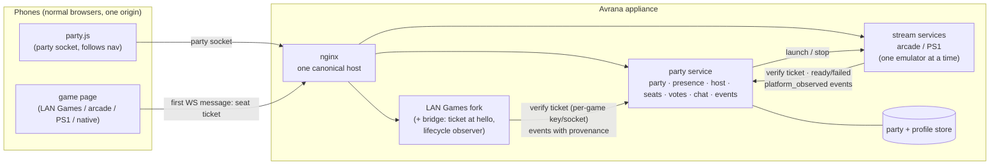

# Game integration: capabilities, runtime, and the party contract

Status: **draft contract (2026-09-24); nothing here is built.** Field names and enums will change
when the first two consumers use them. Context: `PARTY-PLATFORM.md`, `docs/adr/0003-ids-and-keys.md`,
`GAME-INSTALLATION.md`, `PERSONAL-VIEWPORTS.md`. Code references: `core/…`, `web/…`, `games/…` and
`server.py` are in the Avrana Party Games fork (not published yet; Pi dev clone
`~/avrana-lab/avrana-party-games`); `arcade/…` is in this repo; `ps1/…` is on branch
`ps1-emulation` of this repo.

A game touches the platform through three **separate** things. Keeping them separate is the point:

| | Written by | Answers | Example |
|---|---|---|---|
| **Capabilities** (the manifest) | the game | *What kind of game is this?* | 1–4 players, TV optional, late joiners spectate, 4 controller slots, viewport layouts |
| **Runtime request** | the game package | *How does its code run?* | an emulator profile; a LAN Games module; its own process |
| **Grant** | the appliance (Admin), never the package | *What is it allowed to do here?* | trust tier, content hash, URL path assigned, permissions granted |

Rule: **the package describes and requests; the appliance decides.** A manifest can never set its
own trust tier, URL path or id namespace. Installation is covered in `GAME-INSTALLATION.md`.

### How the pieces connect (target shape, not built)



The party service decides *who* and *what next*; each game decides *how the game plays*. Games
never see device tokens; the party never runs game rules.

---

## 1. Capability manifest v0 (draft)

```json
{
  "manifest": 0,
  "id": "ps1-bomberman",
  "title": "Bomberman Party Edition",
  "kind": "emulated",
  "players": {"min": 1, "max": 4},
  "screen": "tv_optional",
  "input": {"model": "controller_slots", "slots": 4},
  "shared_video": true,
  "personal_viewports": null,
  "private_player_ui": false,
  "late_join": "spectator_only",
  "spectators": "watch",
  "teams": "none",
  "chat": "platform",
  "results": "none",
  "stats": ["participation"],
  "achievements": false,
  "session_minutes": [5, 20]
}
```

| Field | Values | Meaning |
|---|---|---|
| `kind` | `native` \| `emulated` \| `other` | What the game *is* (not how it runs — that is the runtime) |
| `players` | `{min, max}` | Filters the "what next?" list by who is present |
| `screen` | `no_tv_needed` \| `tv_optional` \| `tv_required` | TV is optional for the product; a game may still require one |
| `input.model` | `browser_native` \| `controller_slots` \| `hotseat` | Private phone UI, N gamepads, or one pad passed around |
| `shared_video` | bool | One encoded stream to every phone |
| `personal_viewports` | `null` or a viewport profile | Per-seat crops of the shared frame (`PERSONAL-VIEWPORTS.md`) |
| `private_player_ui` | bool | Per-player private screens (hands, roles, prompts) |
| `late_join` | `spectator_only` (default) \| `next_round` \| `supported` | What happens to someone who arrives mid-game. Games may add their own finer policy (deal-in, open-seat filling) behind `supported` |
| `spectators` | `none` \| `watch` \| `participate` | Whether spectators exist and whether they have mechanics |
| `teams` | `none` \| `in_game` \| `party` | `party` = reuses the party's teams and can report team results |
| `chat` | `platform` \| `none` | Uses party chat (games don't build their own) |
| `results` | `none` \| `authoritative` | A *claim*; the event sink takes provenance from the grant, not from this field |
| `stats` | list | What the game can report, e.g. `participation`, `winner`, `scores`, `eliminations` |
| `achievements` | bool | Defines game achievements |
| `session_minutes` | `[min, max]` | Rough length, for queue/vote filters |

**Not in the manifest:** URLs, paths, commands, ports, trust, permissions (those are runtime and
grant), and physical seating (not a platform concept).

### Draft capabilities for today's titles

| id | kind | players | screen | input | shared video | viewports | late join | spectators | results |
|---|---|---|---|---|---|---|---|---|---|
| `bluff` | native | 1–6 (bots fill) | no_tv_needed | browser_native + private UI | no | — | spectator_only | watch (cap 6) | authoritative *(once a result event exists; today the winner lives only in game state)* |
| `arcade-gauntlet2` | emulated | 1–2 | tv_optional | controller_slots (2) | yes | — | supported (free slot) | none today (409 when full) | none |
| `ps1-bomberman` | emulated | 1–4 | tv_optional | controller_slots (4, multitap port 2) | yes | not a split-screen game | supported (free slot) | watch | none |
| `ps1-worms` | emulated | 1–4 people | tv_optional | hotseat (1 slot) | yes | — | spectator_only | watch | none (hot-seat can't attribute turns) |
| LAN Games titles | native | from the registry | per registry `tv` flag | browser_native | no | — | spectator_only (locked at countdown) | watch | none until a game adds a result hook |

LAN Games manifests should be **derived** from `games/registry.py` (which already carries min/max
players, solo, tv, category and an `EXTERNAL` list), never hand-written per game.

---

## 2. Runtime request (separate from capabilities)

```json
"runtime": {"type": "emulator_profile", "sdk": 0,
            "resources": ["emulator_slot", "hw_encoder"], "permissions": []}
```

| `type` | What runs | Who may use it (see `GAME-INSTALLATION.md`) |
|---|---|---|
| `lan_games_module` | Python module inside the LAN Games process | built-in and explicitly trusted games only |
| `emulator_profile` | data only: content match, pinned core, allowlisted options, slot map, viewports | anyone (content is user-supplied; cores are platform-pinned) |
| `process` | the game's own server, speaking HTTP/WebSocket over a unix socket | later, sandboxed |
| `static_web` | only browser files, multiplayer via a platform relay | later, sandboxed |
| `external` | a platform-known service (today's arcade and PS1 stream servers) | built-in |

`resources` name platform-defined exclusive resources (e.g. the single `emulator_slot`: only one
emulated game runs at a time on a Pi 4 — CPU, one hardware encoder budget, power). Today nothing
enforces that; the party launcher will.

---

## 3. The party contract (four optional pieces)

Without any of them a game keeps working exactly as today. With them it joins the party.

### 3.1 Seat ticket handshake (v1)

- The party issues a **short-lived, single-use ticket** bound to one presence and **one game**
  (an audience `game_id`, so it can't be replayed into another game).
- The game page sends it as the **first WebSocket message** — never in the URL (nginx logs query
  strings; PS1 currently puts its token in `?token=`, which must change before PS1 goes behind
  nginx).
- The game verifies it with the party service over a **per-game unix socket** (which also
  identifies the caller) or with a **per-game** key — never a key shared by all games, which would
  let any game mint tickets for any other.
- The game then uses the **game key** the platform binds to that ticket: an opaque secret scoped
  to (game session, participant), sent only to that participant's own client (ADR 0003). For
  party-launched sessions the game's legacy "accept any client token" path is **off**.
- **Where seats are bound differs by game:** LAN Games assigns players at its countdown, so what
  arrives at `hello` is a participant (presence-level) key and the seat is bound later; PS1 and the
  arcade bind a controller slot at connect time. The bridge reports the resulting seat/slot back.
- LAN Games also keys **avatar photos** (`x-wc-token`) and **chat identity** by the same token, so
  the bridge must map those too.
- **Honest limit:** built-in LAN Games modules share one process, so the ticket audience and any
  per-game key are per *process* there — any module could read any game's keys. That is acceptable
  only because built-in code is trusted; per-game isolation starts with sandboxed third-party games
  (`GAME-INSTALLATION.md`).

### 3.2 Event sink

The game (or a thin observer beside it) reports lifecycle events. Draft envelope:
`{v, party_id, game_id, instance, ts, kind, presence_id, seat_id, provenance, data}`; kinds:
`session_started`, `session_ended{completed|abandoned}`, `seat_joined`, `seat_left`, `result`,
`stat`. **Provenance comes from the grant**, not the manifest's own `results` claim; emulated games
can emit only `platform_observed` unless a per-game adapter exists; community games are labelled
`community`. Flags travel with results: bot seats, autopilot turns, forfeits, abandoned games
(never a win).

### 3.3 `party.js` follow client

A tiny script that holds the party socket, knows `nav_seq`, follows party navigation to URLs the
**platform** assigned (manifest ids → platform paths), and offers "Party Home". For LAN Games it is
injected once by the shared `hubnet.js` (except **WORDCLASH**, which has its own room engine and
needs its own bridge or stays legacy). For untrusted games it must live in a **platform frame**
outside the game, because a game's own JavaScript must never be able to call host controls.

### 3.4 Host checks

Games gain one permission hook — a `may(participant, verb)` check where they dispatch actions
(start, settings, end, rematch) — that allows everything by default and asks the party when a game
runs party-launched. Rule gates (minimum players) stay game-specific.

---

## 4. What today's code duplicates (and where it converges)

From a read-only audit of the LAN Games fork, BLUFF, the arcade and PS1 (2026-09-24):

| Concept | Today | Platform version | Stays in the game | Smallest seam |
|---|---|---|---|---|
| **Tokens** | 4 validators, 2 storage keys; LAN Games tokens client-mintable; PS1 server-minted and constant-time; arcade none | server-issued device cookie → presence; per-(session, participant) game key | per-session player numbers | `hello` accepts a ticket (`core/net.py`, WORDCLASH separately); PS1 reads a first message before `claim()` |
| **Reconnect / grace** | ≥ 5 behaviours: LAN lobby none (reload loses ready), in-game held till end, all-drop = instant abandon; Spades/Duel autopilot after ~1–2 s; BLUFF 30/60 s + autopilot + pause + 300 s abandon; PS1 30 s; arcade 0 s. Streams need a manual "Tap Play" to reconnect | one presence grace at party level (tuned from the N2 playtest); seat hold as a manifest policy, default "until the game ends" | what "away" means in play (autopilot, pause, neutral input) | `game_player_left/back` called from platform presence instead of socket counts |
| **Presence** | `Player.connected`, BLUFF's five states, chat online count, `/api/games` counts, PS1 `/stats` | BLUFF's vocabulary + spectator, owned by the party | — | `Player.public()` |
| **Seats / late join** | 5 policies: LAN locked at countdown; Duel 2 seats + bench; BLUFF 6 + bots; PS1 any open slot; arcade first free or HTTP 409 | spectator by default; `late_join` in the manifest | seat → slot mapping (colours, key banks, bots) | the countdown lock-in; `claim()` |
| **Spectators** | LAN unlimited; BLUFF cap 6; PS1 unlimited (each costs a WebRTC transport); arcade none | a presence without a seat; a party-wide cap; server drops their input | per-viewer masking | `state_for(None)` |
| **Host** | nobody: any ready player starts; anyone changes settings, clears chat, sends `again`; BLUFF lets a spectator end a paused table after 60 s; PS1 title chosen on the command line | host-only start/settings/end/rematch; host succession replaces BLUFF's takeover rule | rule gates | `may(participant, verb)` in `GameBinding.dispatch` |
| **Navigation** | per-page home links; PS1 has no way out; LAN game end returns to *that game's* lobby | `party.js` + Party Home | — | `hubnet.js`; one line each in arcade/PS1 pages |
| **Launch** | LAN always on (one process); arcade a boot service with a fixed ROM; PS1 by hand over SSH; nothing enforces one emulator at a time | a party launcher owning the emulator slot; PS1's "port bound only after startup" is a free readiness signal | — | systemd/nginx changes → owner approval |
| **Other** | near-identical WebSocket/push code in `net.py` and WORDCLASH; 5 different rate limits and message caps; Origin checks only in the stream servers; name sanitizing copied; two `/stats`, two `/health`; preferences duplicated | origin allowlist, per-presence rate limits, names, participation stats | key banks, uinput, WebRTC stats | — |

**Multiple tabs:** LAN Games allows up to 4 sockets per token and BLUFF treats a second tab as
normal. The platform rule is therefore "every connection resolves to one presence; input streams
(controller slots) accept one controlling connection per seat", not "one socket per person".

### Security gaps noticed in passing (not yet fixed)

- The arcade's `/stats` is reachable through nginx today (`party.local/arcade/stats`) and exposes
  peer IPs and client stats; PS1 restricts the same endpoint to localhost.
- PS1's localhost-only check would stop working once PS1 sits behind nginx (every request then
  comes from 127.0.0.1). Both need a proper admin/internal path when the single origin lands.
