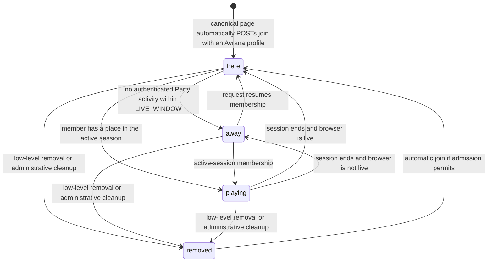
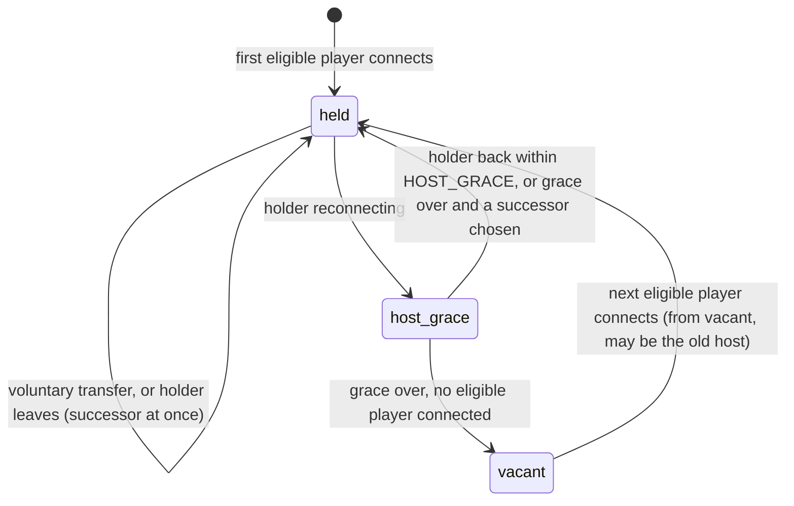

```mermaid
stateDiagram-v2
  [*] --> open: session created
  open --> occupied: dealt / late-join policy / host promotes (owner connected)
  open --> disconnected: dealt to a member still within grace
  occupied --> disconnected: owner reconnecting (neutral input at once)
  disconnected --> occupied: owner returns (same seat)
  disconnected --> away: SEAT_GRACE (still reserved; the game autopilots, idles or pauses)
  away --> occupied: owner returns
  occupied --> released: owner leaves / host removes
  disconnected --> released: host removes
  away --> released: host removes / auto-release (open-seat games only)
  released --> open: the slot is free; a refill gets a NEW seat id and game key
```

# Party lifecycle: party, presence, host, seats

Status: **canonical lifecycle narrative, reconciled 2026-10-01.** Party Core v0 implements
membership, liveness, host grace/succession and one session (ADR 0006); AVR-128 authoritative
navigation, ADR 0010 Play/Watch with host-only Start, and AVR-134 arcade lifecycle are deployed,
server-side verified. ADR 0011 console behavior is accepted/merged source; deployment and
Tier 3 phone validation remain AVR-212. [SYSTEM](../SYSTEM.md) owns verified revisions.

The earlier offline model (`experiments/party-model/`, `experiment/party-sim`, 52 tests + fuzz)
is historical design evidence. Its socket-based presence and lobby/intermission UI are not the
current console contract. Seat reservation/grace/release rules below remain requirements for
integration. AVR-130 arcade reservation changes merged during this reconciliation in PR #35,
with deployment/real-phone acceptance still unverified by published findings. They do not prove that
a universal seat layer, votes, kicks or intermission seating is implemented.
Concepts: `PARTY-PLATFORM.md` §5; identifiers: [ADR 0003](../adr/0003-ids-and-keys.md).

## Locked decisions this document implements

- **One appliance = one party.** No multi-party, no party selector.
- **The host is disposable.** The party never depends on one client; host loss → grace →
  succession; voluntary transfer; a returning old host does not take the role back.
- **Late joiners are spectators by default**; each game may opt into more (next round,
  join-in-progress, open-seat filling) via its manifest's `late_join`.
- **Physical seating is not a platform concept.** "Seating" below means *who holds which game slot*,
  carried from one game to the next — never table position or airplane rows.

## Global rules

- **R1 — one change at a time, with a version.** The party service applies changes serially. Every
  host action carries the party version the client saw (`if_version`); host rights are re-checked
  when the action is applied. A request from a former host, or a stale one, is refused.
- **R2 — navigation moves only on a committed transition.** `nav_seq` increases when a game has
  actually started or ended, never on intent. Nothing ever has to "revert".
- **R3 — a disconnected or away seat is never "free".** Only a released seat can be refilled, and a
  refill always gets a new seat id and a new game key.
- **R4 — deadlines hold at apply time.** Every due timer (host grace, launch timeout, seat grace and
  release, table abandon, vote close, party idle) is applied *before* each operation, not only by a
  background tick. A vote after its deadline, a start after the launch timed out, or a request from
  a host whose grace ran out is refused even if no tick has run. Timer-driven changes bump the
  version like any other change.
- **R5 — navigation is keyed by `(party_id, nav_seq)`.** `nav_seq` restarts in a new party, so a
  phone must never compare the counter alone.
- **R6 — a saved profile has at most one live presence.** A presence can't hold two profiles; an old
  phone that rejoins after its profile moved to another phone comes back as a guest (proposal).

## State machines

### Party location (ADR 0011 product states)

```mermaid
stateDiagram-v2
  [*] --> home: profile-backed automatic presence
  home --> setup: host selects a pregame title
  setup --> game: Play/Watch chosen; host Start; launch confirmed
  setup --> home: host cancels or launch fails
  home --> game: host launches a direct title; launch confirmed
  game --> results: game reports completion; results held
  game --> home: host End confirmed
  results --> setup: host Play again for a pregame title
  results --> game: host relaunches a direct title
  results --> home: host Party Home; held game room released
  home --> [*]: idle expiry or administrative cleanup
```

This is the shared **location**, not a replacement for protocol states
`setup/launching/active/ending/ended`. While a pregame launch is pending the location remains
setup; failed launch returns home. Host switching ends the old session before launching the
next; an unconfirmed stop blocks the switch. Core's idle `lobby` maps to home. Completed results
are held until the host moves on; there is no game's automatic lobby timer in a Party round.
All member surfaces follow the authoritative location on load/reconnect/change. A finished
session outcome controls whether it exposes results or home; see ADR 0011 and `core.py`.

### Presence (current membership and liveness)

Normal browser flow has **no Leave Party UI**. Silence, screen lock, a tab closing or navigation
into a game does not itself remove membership. Core derives liveness from authenticated Party
requests (polls, game heartbeats, ticket fetches); active-session members count as playing.
The game owns its own disconnect/autopilot timers. The lower-level `leave` operation still
exists for removal/cleanup and tests; kick/admin/session cleanup policies still need explicit
semantics. A future kick policy must prevent automatic re-admission for that Party. No kick UI
or Public/Demo admission is claimed implemented here.

### Host role

Grace and succession are implemented; voluntary transfer below remains the broader design.
Current Core selects the earliest-joined eligible member who is here or playing. Removal uses
the low-level operation; no ordinary Leave button is implied.

Current Core eligibility means a non-removed member who is here or playing; it does not
require a game seat. A future TV/public surface never becomes host. The graph also retains
proposed voluntary transfer and uses reconnecting as a description of loss of liveness.

### Seat (per game session; reservation/grace requirements)

Preserve these rules for AVR-130 acceptance. BLUFF owns its reconnect identity. Party PR #35
adds arcade session-local, 60-second reservations in source; published findings have not verified
their deployment or physical acceptance. Disconnect must neutralize input without freeing a reserved slot;
only explicit release permits a new owner. This diagram is the target seat contract.

## Awkward states and their rules (design requirements unless marked current)

The table preserves broader seat/liveness requirements from the model. Current Core uses
request-based liveness and game-owned grace, rather than a socket-count-based presence machine.
“Leaves” below means lower-level removal or a game-level release, never normal Party Leave UI.

| Situation | Rule |
|---|---|
| Host transfers to someone who disconnects at that moment | Refused if the target is already reconnecting; otherwise the target holds it with normal grace |
| Host leaves while a game is launching | The launch belongs to the party and continues; whoever is host now may cancel; with no host it completes or times out |
| Two taps, or the host changes mid-request | R1 (version check); "select" while launching is refused: "starting X — cancel first" |
| Vote open when the host changes | The round keeps its deadline and voters; the new host inherits final authority |
| Spectator promoted while the owner of the last seat reconnects | The owner always reclaims their own seat (R3); only a released seat is contested; first committed request wins, the loser spectates with priority next deal |
| The only player disconnects mid-game | Neutral → away → the game pauses; TABLE_ABANDON after the **last occupied seat emptied** (disconnected or away — counted from that moment, not from a tick) the session ends as `abandoned`, the party goes home with seating saved, and an emulator is stopped to save power |
| Every phone sleeps | Host becomes vacant after grace; the party waits; it ends after PARTY_IDLE with nobody connected |
| Same phone, two tabs | One membership; current Core liveness follows authenticated activity, not individual tab closure. Target input rule: newest controlling connection owns a seat, older ones show "opened elsewhere" |
| Seat owner returns after the host gave the seat away | Spectator, with priority at the next deal; their old game key is dead |
| Arrival during setup/launch | During setup, a member who is here must choose Play/Watch; start freezes the roster, and subsequent arrivals watch (ADR 0010) |
| Game or service crash | Historical target: report the crash and preserve seating where supported. Current protocol outcomes are `completed`, `abandoned`, `ended_by_host`, `launch_failed`; Core restart resets the memory-only Party. Retry is the host’s call |
| Host is the only player and leaves | Immediate succession to another connected player, otherwise vacant |
| An emulated game refuses to start (power gate, port busy) | Current Party launch fails to home; no game location is committed. Setup may already have been committed. Future power-gate messaging must follow this authority |
| Switching between emulated games | End A (everyone sees "Starting B…"), stop A's service, launch B; a late "ready" from a cancelled launch is ignored by `launch_id` and that service is stopped |
| A profile moves to a new phone mid-game | The old device's sockets close; the seat gets a new game key |
| A phone sleeps during setup/start | Current ADR 0010: away members do not block Start; only here members’ choices form the starting roster, and arrivals after Start watch. Existing game seats follow game-owned reconnect policy. Future seat reservation across other runtimes must keep disconnected/away seats reserved until release. PR #35’s arcade reservations need AVR-130 physical acceptance. |

## Timers: implemented Core values and proposed seat/model defaults

| Timer | Value | Precedent |
|---|---|---|
| HOST_GRACE | 30 s | implemented in Party Core after the 45 s liveness window |
| PRESENCE_GRACE, SEAT_GRACE | 60 s (a game may set longer) | PS1 holds a slot 30 s; BLUFF waits 30 s (prompts) / 60 s (own turn) before autopilot |
| Succession | earliest-joined eligible member here or playing (deterministic) | implemented in Party Core |
| LAUNCH_TIMEOUT | 60 s | — |
| TABLE_ABANDON | 5 min | BLUFF |
| Away-seat auto-release | only for games that declare open seats, after 5 min; otherwise the host removes | — |
| PARTY_IDLE | 3 h with nobody connected (plane naps); never while anyone is connected | — |

Current Core uses LIVE_WINDOW 45 s, HOST_GRACE 30 s past liveness, LAUNCH_TIMEOUT 60 s,
END_TIMEOUT 15 s and PARTY_IDLE 3 h (no live members/session). Members in an active session
count as playing. The table retains proposed seat/model defaults, not evidence of arcade
deployment or physical behavior. Tune future seat policies from real-phone evidence and AVR-130, with scope in Linear.

## Still open

**Does a party survive an appliance reboot?** Options:

- **A. Ephemeral** — a reboot starts a new party. Simplest; guests lose names and seating.
- **B. Resume if fresh** — snapshot the party (presences, personas, host, seating, teams, queue —
  never a live game session) to durable storage on every change; on boot, resume if the snapshot is
  under ~30 min old (land at home, everyone reconnecting, host grace starting at boot);
  otherwise start new.
- **C. Ask** — the first player to connect after boot chooses "Resume the 21:40 party" or "New party".

B (with C as a fallback) fits the known failure mode — under-voltage resets — but the decision is
the owner's. Current Core is memory-only; device identity can survive, but Party state does not.
Succession is already deterministic and navigation is settled by ADR 0011. Still open:
spectator voting/nominating, host-less kiosk parties, and:

- **`if_version` scope.** The version is party-wide, so a guest joining or a phone reconnecting
  makes the host's in-flight request stale ("the party changed — try again"). Safe but occasionally
  annoying; the alternative is a narrower version covering only lobby/seat/launch state.

Presence now resumes automatically with a profile on canonical Party/game surfaces through a
POST (ADR 0011). The old model's `observe()` rule remains historical simulation evidence;
it does not require a Join button. Captive probes remain outside this flow.

**Kick (proposed for v0; owner to confirm — not in the locked decisions or an ADR):** a kick removes the presence from the current party and bars that
*device token* from rejoining this party. It is **not a ban**: a private tab is a new device, so
only the Wi-Fi password — or host admission in Public/Demo mode — keeps someone out
(`PARTY-PLATFORM.md` §7, §13).
