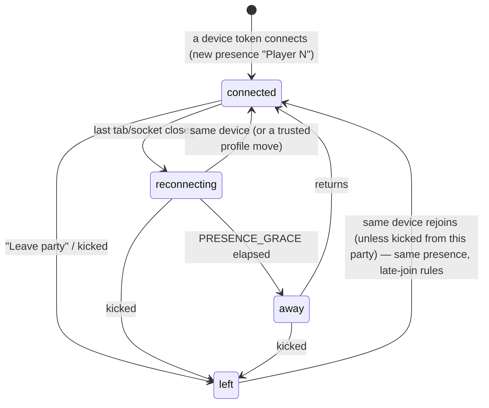
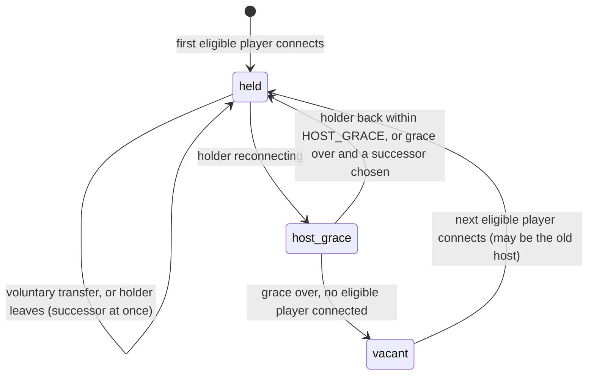

# Party lifecycle: party, presence, host, seats

Status: **design (2026-09-24). Rules are proposals checked by an offline simulation; nothing is
built.** Simulation: `experiments/party-model/` on branch `experiment/party-sim` (43 tests incl. a
300-seed fuzz). Concepts: `PARTY-PLATFORM.md` §5; identifiers: `docs/adr/0003-ids-and-keys.md`.

## Locked decisions this document implements

- **One appliance = one party.** No multi-party, no party selector.
- **The host is disposable.** The party never depends on one client; host loss → grace →
  succession; voluntary transfer; a returning old host does not take the role back.
- **Late joiners are spectators by default**; each game may opt into more (next round,
  join-in-progress, open-seat filling) via its manifest's `late_join`.
- **Physical seating is not a platform concept.** "Seating" below means *who holds which game slot*,
  carried from one game to the next — never table position or airplane rows.

## Three global rules

- **R1 — one change at a time, with a version.** The party service applies changes serially. Every
  host action carries the party version the client saw (`if_version`); host rights are re-checked
  when the action is applied. A request from a former host, or a stale one, is refused.
- **R2 — navigation moves only on a committed transition.** `nav_seq` increases when a game has
  actually started or ended, never on intent. Nothing ever has to "revert".
- **R3 — a disconnected or away seat is never "free".** Only a released seat can be refilled, and a
  refill always gets a new seat id and a new game key.

## State machines

### Party

```mermaid
stateDiagram-v2
  [*] --> lobby: first device connects (party created)
  lobby --> launching: host selects a game (launch_id; always-on games are ready at once)
  launching --> in_game: ready AND launch_id matches → deal seats, nav+1
  launching --> lobby: failed / timeout / host cancels (nav unchanged)
  in_game --> intermission: game ends / host ends / crash / table abandoned → save seating, nav+1 home
  in_game --> launching: host switches game (current session ends first)
  intermission --> launching: host picks a rematch or the next game
  intermission --> lobby: host "Home"
  lobby --> ended: host ends / idle with nobody connected / admin
  in_game --> ended: host ends (session abandoned)
  intermission --> ended: host ends / idle
  ended --> [*]: next connect creates a NEW party (devices and profiles are appliance-scoped)
```

### Presence



### Host role



"Eligible" = a connected player presence: not a TV/"screen" presence, not someone who left.

### Seat (per game session)

```mermaid
stateDiagram-v2
  [*] --> open: session created
  open --> occupied: dealt / late-join policy / host promotes (owner connected)
  open --> disconnected: dealt to a member still within grace
  occupied --> disconnected: owner reconnecting (neutral input at once)
  disconnected --> occupied: owner returns (same seat)
  disconnected --> away: SEAT_GRACE (still reserved; the game autopilots, idles or pauses)
  away --> occupied: owner returns
  occupied --> released: owner leaves / host removes
  disconnected --> released: host removes
  away --> released: host removes / auto-release (open-seat games only)
  released --> open: the slot is free; a refill gets a NEW seat id and game key
```



## Awkward states and their rules

| Situation | Rule |
|---|---|
| Host transfers to someone who disconnects at that moment | Refused if the target is already reconnecting; otherwise the target holds it with normal grace |
| Host leaves while a game is launching | The launch belongs to the party and continues; whoever is host now may cancel; with no host it completes or times out |
| Two taps, or the host changes mid-request | R1 (version check); "select" while launching is refused: "starting X — cancel first" |
| Vote open when the host changes | The round keeps its deadline and voters; the new host inherits final authority |
| Spectator promoted while the owner of the last seat reconnects | The owner always reclaims their own seat (R3); only a released seat is contested; first committed request wins, the loser spectates with priority next deal |
| The only player disconnects mid-game | Neutral → away → the game pauses; if every seat is away for TABLE_ABANDON the session ends as `abandoned`, the party goes home with seating saved, and an emulator is stopped to save power |
| Every phone sleeps | Host becomes vacant after grace; the party waits; it ends after PARTY_IDLE with nobody connected |
| Same phone, two tabs | One presence; disconnected only when the last tab closes; the newest tab owns seat input, older ones show "opened elsewhere" |
| Seat owner returns after the host gave the seat away | Spectator, with priority at the next deal; their old game key is dead |
| Late join during launching | Treated as the lobby: seats are dealt at *ready*, not at *select* |
| Game or service crash | `session_ended{crashed}`, home with seating kept; retrying is the host's call |
| Host is the only player and leaves | Immediate succession to another connected player, otherwise vacant |
| An emulated game refuses to start (power gate, port busy) | Back to the previous screen; `nav_seq` never moved; a system message says why; the title is greyed out |
| Switching between emulated games | End A (everyone sees "Starting B…"), stop A's service, launch B; a late "ready" from a cancelled launch is ignored by `launch_id` and that service is stopped |
| A profile moves to a new phone mid-game | The old device's sockets close; the seat gets a new game key |
| A phone was asleep when the host started the game | It is still dealt a seat (neutral until it returns): a lobby member is not a late joiner |

## Proposed defaults (proposals, not decisions)

| Timer | Value | Precedent |
|---|---|---|
| HOST_GRACE | 30 s | none (no existing game has a host); a proposal |
| PRESENCE_GRACE, SEAT_GRACE | 60 s (a game may set longer) | PS1 holds a slot 30 s; BLUFF waits 30 s (prompts) / 60 s (own turn) before autopilot |
| Succession | earliest-joined connected eligible player (deterministic, explainable); random is acceptable | owner: "random/simple" |
| LAUNCH_TIMEOUT | 60 s | — |
| TABLE_ABANDON | 5 min | BLUFF |
| Away-seat auto-release | only for games that declare open seats, after 5 min; otherwise the host removes | — |
| PARTY_IDLE | 3 h with nobody connected (plane naps); never while anyone is connected | — |

Tune the grace timers from the N2 real-phone playtest.

## Still open

**Does a party survive an appliance reboot?** Options:

- **A. Ephemeral** — a reboot starts a new party. Simplest; guests lose names and seating.
- **B. Resume if fresh** — snapshot the party (presences, personas, host, seating, teams, queue —
  never a live game session) to durable storage on every change; on boot, resume if the snapshot is
  under ~30 min old (land in the lobby, everyone reconnecting, host grace starting at boot);
  otherwise start new.
- **C. Ask** — the first player to connect after boot chooses "Resume the 21:40 party" or "New party".

B (with C as a fallback) fits the known failure mode — under-voltage resets — but the decision is
the owner's. Also open: the exact succession policy, the detour policy for forced navigation,
spectator voting/nominating, host-less kiosk parties.

**Kick (decided for v0):** a kick removes the presence from the current party and bars that
*device token* from rejoining this party. It is **not a ban**: a private tab is a new device, so
only the Wi-Fi password — or host admission in Public/Demo mode — keeps someone out
(`PARTY-PLATFORM.md` §7, §13).
